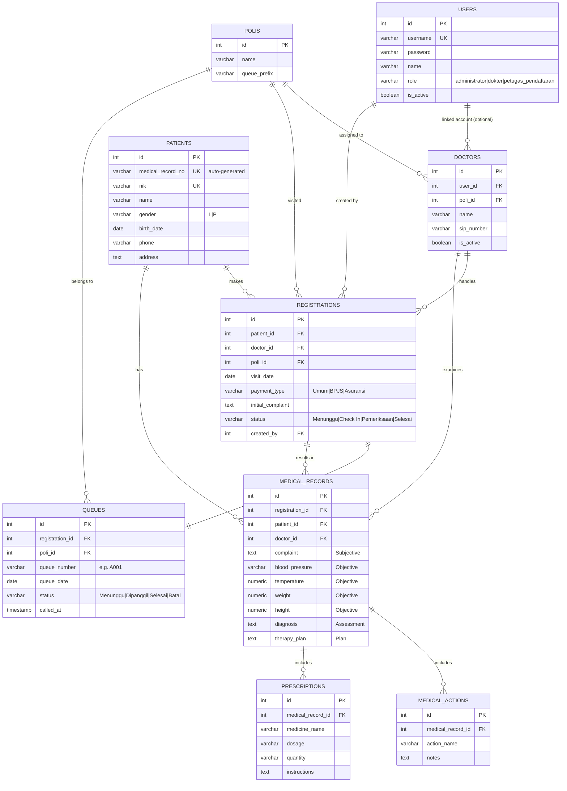

# Entity Relationship Diagram — Mini Clinic Information System

## Penjelasan Relasi

- **USERS → DOCTORS** (1:0..1): satu akun user dengan role `dokter` dapat memiliki satu data master dokter (opsional, agar admin/petugas tidak wajib punya profil dokter).
- **POLIS → DOCTORS** (1:N): satu poli dapat memiliki banyak dokter.
- **PATIENTS → REGISTRATIONS** (1:N): satu pasien dapat melakukan banyak kunjungan/pendaftaran.
- **REGISTRATIONS → QUEUES** (1:1): setiap pendaftaran otomatis menghasilkan satu nomor antrean.
- **REGISTRATIONS → MEDICAL_RECORDS** (1:N, umumnya 1:1 per kunjungan): hasil pemeriksaan dokter tercatat sebagai rekam medis yang terhubung ke pendaftaran terkait.
- **MEDICAL_RECORDS → MEDICAL_ACTIONS / PRESCRIPTIONS** (1:N): satu rekam medis dapat memiliki banyak tindakan medis dan banyak resep obat.
- **PATIENTS → MEDICAL_RECORDS** (1:N): digunakan untuk menampilkan riwayat pemeriksaan pasien di seluruh kunjungan.
